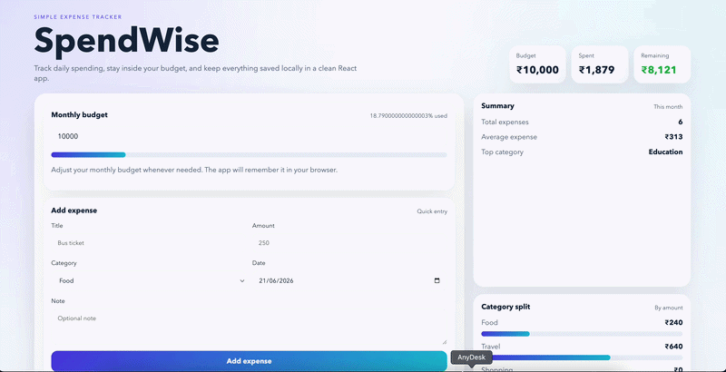

# SpendWise

SpendWise is a React expense tracker built with Create React App.

## Features

- Add expenses with title, amount, category, date, and note
- Set a monthly budget
- See total spent, remaining budget, and average expense
- Filter expenses by category
- Search expenses by text
- View category-wise spending
- Remove expenses from the list
- Local persistence with `localStorage`
- Clean light-mode UI

## Demo



## Tech Stack

- React 18
- Create React App
- Plain CSS
- Browser `localStorage`

## Run Locally

```bash
cd /Users/vishalshivakumarkanakamamidi/Desktop/ajproj/expense-tracker
npm install
npm start
```

## Build

```bash
npm run build
```

## Project Structure

```text
expense-tracker/
├── public/
│   └── index.html
├── src/
│   ├── App.jsx
│   ├── index.js
│   └── styles.css
├── package.json
└── README.md
```
